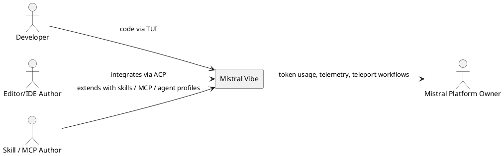
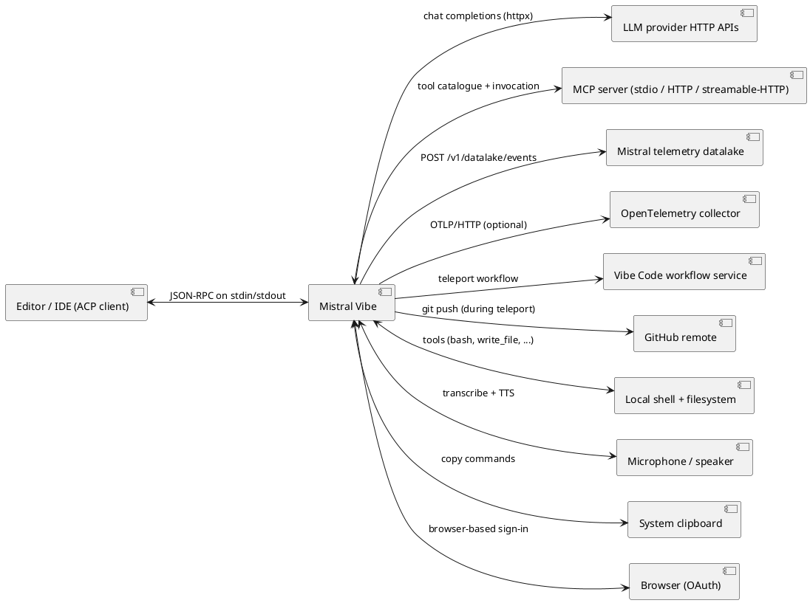
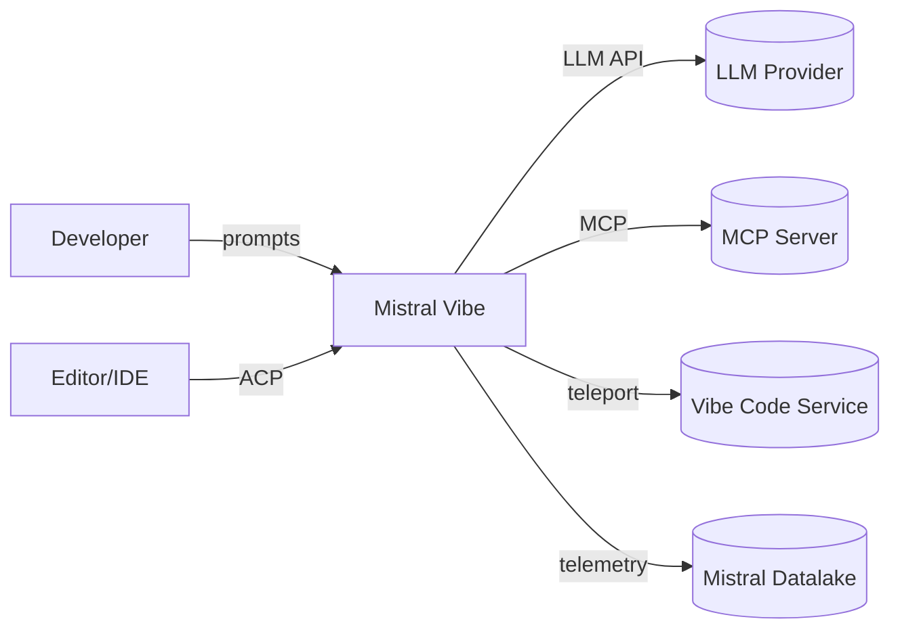
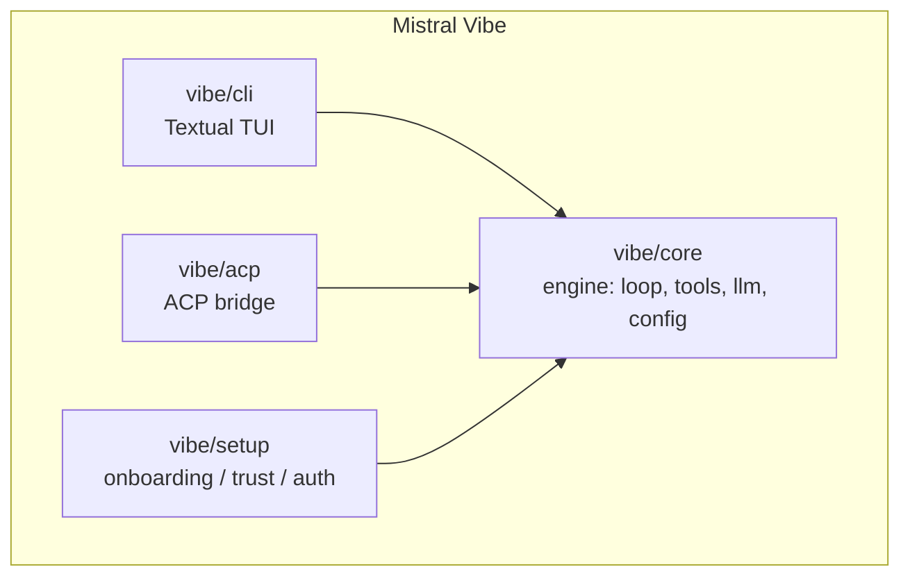
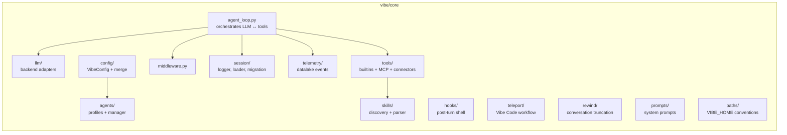
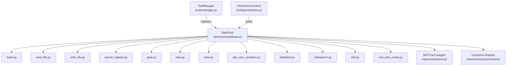
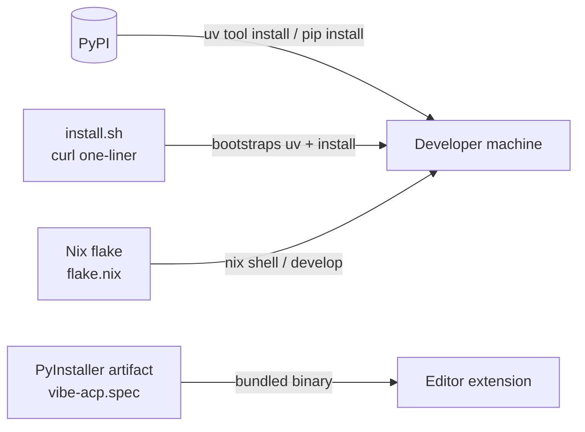
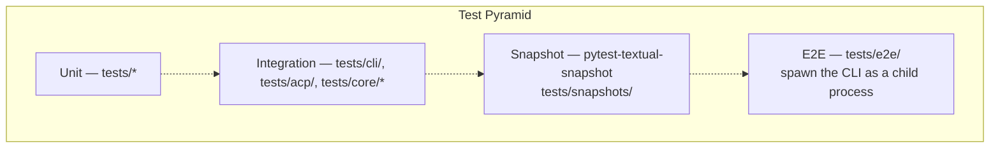

# Architecture Documentation — Mistral Vibe

> Synthesised from Q3 of `docs/QUESTION_TREE.adoc`. Every claim cites its
> source question or `file:line`. Items the team has not yet confirmed are
> kept as `[OPEN — Q-ID]` rather than filled in.
> Format: arc42, all 12 sections.

---

## §1 Introduction and Goals

### 1.1 What is Mistral Vibe?

*(See Q3.1.1, Q1.1.)* Mistral Vibe is Mistral AI's open-source command-line
coding assistant. It exposes a conversational interface to a local codebase
via a controlled set of tools. The system has two executables — `vibe`
(interactive / programmatic CLI) and `vibe-acp` (Agent Client Protocol bridge
for editors). Source: `README.md:20`, `pyproject.toml:75-77`.

### 1.2 Goals

Functional goals (G-001..G-008) are catalogued in `docs/prd.md` §2.1.

### 1.3 Quality goals — top three

**[OPEN — Q3.1.2]** The team has not ranked its top three quality goals.
Phase 1 inferred four candidates from the code (terminal usability,
permissioned safety, extensibility, multi-provider portability); their
ranking remains unrecorded.

### 1.4 Stakeholders

| Role | Concerns | Source |
|---|---|---|
| Developer (primary user) | Productivity, safety of file/shell side effects | UC-001..UC-017 |
| Editor / IDE author | ACP contract stability, packaging predictability | UC-016, `docs/acp-setup.md` |
| Mistral platform owner | LLM API usage, telemetry, Vibe Code adoption | `vibe/core/telemetry/`, `vibe/core/teleport/` |
| MCP-server / skill author | Extension surface stability | UC-011, UC-012, BR-040..BR-048 |
| Operations (CI, packaging) | Install paths, rollback, version pinning | `pyproject.toml`, `flake.nix`, `vibe-acp.spec` |
| Other stakeholders | **[OPEN — Q3.3.1.a]** legal/compliance/support/billing involvement |

---

## §2 Constraints

### 2.1 Technical constraints *(Q3.2.1)*

| Constraint | Source |
|---|---|
| Python ≥ 3.12 | `pyproject.toml:6, 106, 131` |
| `from __future__ import annotations` enforced | `pyproject.toml:159` |
| Strict pyright across `vibe/**` and `tests/**` | `pyproject.toml:115-122` |
| Ruff for lint + format | `pyproject.toml:124-160` |
| `uv` as the only build/run/test entry point | `AGENTS.md:9-15` |
| Asyncio orchestration in the agent loop | `AGENTS.md:51` |
| Pydantic for all external data parsing | `AGENTS.md:46` |

### 2.2 Distribution constraints *(Q3.2.2)*

PyPI package `mistral-vibe`, plus a `curl ... install.sh | bash` channel
(`README.md:33`) and a PyInstaller build for `vibe-acp` (`vibe-acp.spec`).
The Nix flake (`flake.nix`) suggests Nix distribution is in scope.

### 2.3 Coding constraints *(Q3.2.3)*

Documented in `AGENTS.md`. Notable rules:

- No relative imports (`AGENTS.md:42`, enforced via Ruff `TID`).
- No inline `# type: ignore` or `# noqa` (`AGENTS.md:44`).
- `_port.py` suffix for hexagonal ports (`AGENTS.md:23`).
- `StrEnum`/`IntEnum` with `auto()` and UPPERCASE members (`AGENTS.md:34`).
- `pathlib.Path` (sync) / `anyio.Path` (async) — never `os.path`
  (`AGENTS.md:32`).

### 2.4 Why these constraints?

**[OPEN — Q3.2.4]** The constraints are encoded but no ADR records the
trade-offs they were chosen against.

---

## §3 Context and Scope

### 3.1 Business context



Other roles (legal, compliance, support, billing) **[OPEN — Q3.3.1.a]**.

### 3.2 Technical context *(Q3.3.2)*



Source: `vibe/core/llm/backend/`, `vibe/core/tools/mcp/`, `vibe/acp/`,
`vibe/core/telemetry/send.py:30`, `vibe/core/config/_settings.py:531-532`,
`vibe/core/teleport/{nuage,git,teleport}.py`.

---

## §4 Solution Strategy

### 4.1 Style

**[OPEN — Q3.4.1.a]** Hexagonal / ports-and-adapters is the *intended*
style (`AGENTS.md:23`, `_port.py` suffix). The largest module
(`vibe/core/agent_loop.py`, 1716 lines) is not strictly hexagonal —
backends and tools are wired by string identifiers rather than injected
ports. Whether hexagonal is the official target style for the whole code
base or only for newer modules is unresolved.

### 4.2 Major strategic choices the code reveals

| # | Strategy | Evidence |
|---|---|---|
| S-1 | Multi-provider LLM support behind a single `APIAdapter` protocol | `vibe/core/llm/backend/base.py:19`, `factory.py` |
| S-2 | Tool execution is async and event-streamed (`AsyncGenerator[Event, None]`) | `vibe/core/tools/base.py::BaseTool.run` |
| S-3 | Permissioned tool model with four scope kinds | `vibe/core/tools/permissions.py:8-18` |
| S-4 | Layered configuration with explicit merge strategies | `vibe/core/config/schema.py:107-150` |
| S-5 | Trust-folder gate for project-level extension files | `vibe/core/trusted_folders.py` |
| S-6 | TUI on top of Textual rather than custom curses | `pyproject.toml:53` |
| S-7 | Pydantic at every external-data boundary | `AGENTS.md:46-50` |
| S-8 | Fire-and-forget telemetry to the primary Mistral provider | `vibe/core/telemetry/send.py:50-156` |

Rationale for each: see §9 ADRs.

---

## §5 Building Block View

### 5.1 Level 1 — System Context (C4)



### 5.2 Level 2 — Containers / top-level packages *(Q3.5.1)*



Source: `AGENTS.md:5`.

### 5.3 Level 3 — `vibe/core` decomposition *(Q3.5.2)*



### 5.4 Tool component view *(Q3.5.3)*



---

## §6 Runtime View

### 6.1 Interactive turn (UC-003)

```mermaid
sequenceDiagram
    actor Dev as Developer
    participant UI as Textual UI
    participant Loop as AgentLoop
    participant LLM as LLM Provider
    participant Tool as Tool

    Dev->>UI: prompt
    UI->>Loop: enqueue user message
    Loop->>LLM: request (context + prompt)
    LLM-->>Loop: assistant message with tool calls
    loop until no more tool calls
        Loop->>Loop: resolve permission for tool
        alt ASK
            Loop->>UI: approval request
            Dev->>UI: approve / deny
            UI-->>Loop: decision
        end
        Loop->>Tool: run(args)
        Tool-->>Loop: result events / final result
        Loop->>LLM: request (context + tool result)
        LLM-->>Loop: next assistant message
    end
    Loop->>UI: final reply
    UI-->>Dev: rendered output
    Loop->>Loop: run post-turn hooks
```

Source: `vibe/core/agent_loop.py:221+`, `vibe/core/middleware.py`,
`vibe/core/hooks/executor.py`.

### 6.2 Tool approval (UC-004)

```mermaid
sequenceDiagram
    participant Loop as AgentLoop
    participant Tool as BaseTool
    participant Perm as PermissionContext
    participant Sess as Session approvals
    participant UI as UI

    Loop->>Tool: resolve_permission(args)
    Tool->>Perm: ALWAYS / ASK / NEVER + required scopes
    alt permission = NEVER
        Loop->>Loop: report denial to assistant
    else permission = ALWAYS and no sensitive pattern
        Loop->>Tool: run(args)
    else permission = ASK
        Loop->>Sess: check session approvals
        alt matching approval present
            Loop->>Tool: run(args)
        else no match
            Loop->>UI: show approval dialog
            UI-->>Loop: developer decision (+ optional scope)
            opt remember
                Loop->>Sess: store approval
            end
            opt persist
                Loop->>Loop: write to config
            end
            Loop->>Tool: run(args)
        end
    end
```

Source: `vibe/core/tools/permissions.py`, `vibe/core/tools/builtins/bash.py:340-456`.

### 6.3 ACP turn (UC-016)

**[OPEN — Q3.6.3.a]** A formal sequence diagram for ACP initialise / turn /
cancel is not in the repository. The textual flow is documented in
`docs/use_cases/UC-016-use-vibe-from-an-editor-via-acp.md`.

### 6.4 Auto-compaction (UC-010 A1)

```mermaid
sequenceDiagram
    participant Loop as AgentLoop
    participant Compactor as Compaction model
    participant LLM as Active model

    Loop->>Loop: pre-request: context > auto_compact_threshold ?
    alt over threshold
        Loop->>Compactor: summarise older messages
        Compactor-->>Loop: summary
        Loop->>Loop: replace older messages with summary
        Loop->>Loop: emit "vibe.auto_compact_triggered" telemetry
    end
    Loop->>LLM: request with compacted context
```

Source: `vibe/core/agent_loop.py` (auto-compact hook),
`vibe/core/telemetry/send.py:246`.

---

## §7 Deployment View

### 7.1 Where Vibe runs *(Q3.7.2)*

On the developer's machine. All filesystem and shell actions execute as
the local user; there is no sandbox. The only remote-execution path is
teleport (UC-017), which hands the session to Vibe Code.

### 7.2 Distribution channels *(Q3.7.1)*



Source: `pyproject.toml:75-77`, `scripts/`, `vibe-acp.spec`, `flake.nix`,
`README.md:30-58`.

### 7.3 On-disk layout *(Q2.3.1)*

```
~/.vibe/
├── config.toml                       # user config (VibeConfig)
├── .env                              # secrets (MISTRAL_API_KEY, ...)
├── trusted_folders.toml              # trust decisions
├── vibehistory                       # input line history
├── cache.toml                        # update-notifier cache
├── plans/                            # plan-mode write target
├── agents/                           # custom AgentProfile TOMLs
├── prompts/                          # custom system prompts (.md)
├── skills/                           # user-level skills
└── logs/
    ├── vibe.log                      # structured logs (rotated)
    └── session/                      # session_<ts>_<sid>/{meta.json,messages.jsonl}
```

Source: `vibe/core/paths/_vibe_home.py:24-39`.

---

## §8 Crosscutting Concepts

> Per `CLAUDE.md`, this section lists the five baseline concepts in order.

### §8.1 Threat Model

**[OPEN — Q3.8.1]** No threat model is documented. Surface area is large
(arbitrary file writes, arbitrary shell execution, network access via
`webfetch` and MCP, untrusted code in `.vibe/` directories). Mitigations
exist (see §8.2) but are not tied to specific threat IDs.

Until the team supplies a threat model, T-IDs cannot be assigned and
§8.2's mitigations have no traceability target.

### §8.2 Security Concept *(Q3.8.2)*

The mitigations the code already implements:

| Mitigation | Source | Threat targeted |
|---|---|---|
| Trust-folder gate before loading project-level instructions / skills / agents / hooks | `vibe/core/trusted_folders.py` | **[OPEN]** (no T-ID) |
| Tool permission ladder `ALWAYS` / `ASK` / `NEVER` | `vibe/core/tools/base.py:81-108` | **[OPEN]** |
| Bash arity guardrail (allowlist / denylist / arity-required / sensitive) | `vibe/core/tools/builtins/bash.py:340-456` | **[OPEN]** |
| `sensitive_patterns` downgrade `ALWAYS` to `ASK` | BR-016 | **[OPEN]** |
| Telemetry redirected to the primary Mistral provider only (no third-party token leakage) | `vibe/core/telemetry/send.py:50-60` | **[OPEN]** |
| API keys held in environment or `~/.vibe/.env`; keyring dependency present | `vibe/core/config/_settings.py:57-66`, `pyproject.toml:42` | **[OPEN]** |
| `cryptography` dependency for crypto primitives | `pyproject.toml:38` | **[OPEN]** |
| Pyright strict, no inline ignores | `pyproject.toml:115-122`, `AGENTS.md:44` | **[OPEN]** |

Once threats are catalogued (Q3.8.1), each row will trace to a T-ID.

### §8.3 Test Concept *(Q3.8.5)*



Tooling: pytest with `pytest-xdist` parallelism, `pytest-asyncio`,
`pytest-timeout`, `respx` for HTTP mocking, `pytest-textual-snapshot`
for TUI regression. Coverage threshold **[OPEN — Q4.1.2.a]**.

Traceability from Use Case → tests is **[OPEN]** — no formal mapping
exists yet. The acceptance criteria in
`docs/specification/acceptance-criteria.md` are the seed.

### §8.4 Observability Concept *(Q3.8.3)*

| Channel | Source | Configuration |
|---|---|---|
| Structured logs | `vibe/core/logger.py::StructuredLogFormatter` | `LOG_LEVEL`, `LOG_MAX_BYTES` env vars |
| Logfile | `~/.vibe/logs/vibe.log`, rotated | path: `vibe/core/paths/_vibe_home.py:33` |
| Telemetry events | `vibe/core/telemetry/send.py:217-282` | `enable_telemetry` (default true) |
| OpenTelemetry traces | `vibe/core/tracing.py` | `enable_otel`, `otel_endpoint` (excluded from serialised config) |

Telemetry events emitted: `tool_call_finished`, `user_copied_text`,
`user_cancelled_action`, `auto_compact_triggered`, `slash_command_used`,
`new_session`, `session_closed`, plus per-LLM-call request metadata.

### §8.5 Error Handling Concept *(Q3.8.4)*

Conventions documented in `AGENTS.md:72-74`:

- Module-local exception hierarchies (e.g. `AgentLoopError` family at
  `vibe/core/agent_loop.py:150-162`, `ToolError` / `ToolPermissionError`
  at `vibe/core/tools/base.py:77-92`).
- Exception chaining mandatory (`raise NewError(...) from e`).
- Rich exceptions expose `_fmt()` for human-readable output.
- Logging uses positional `%s` arguments, not f-strings.

Retry / circuit-breaker policy: rate-limit detection exists at
`vibe/core/agent_loop.py:166-178`. A central retry policy across all
LLM call sites is **[OPEN — Q3.8.4.a]**.

---

## §9 Architecture Decisions

Ten ADR-shaped decisions are recovered from the code. Each is filed under
`docs/adrs/`. All currently carry status **Accepted (inferred)** because no
stakeholder has confirmed the rationale; per the CLAUDE.md contract, Pugh
cells that require team judgement are left as `?`.

| ID | Topic | File |
|---|---|---|
| ADR-001 | TUI framework: Textual | [adrs/ADR-001-textual-tui.md](../adrs/ADR-001-textual-tui.md) |
| ADR-002 | Dependency-freshness policy: `[tool.uv].exclude-newer` | [adrs/ADR-002-uv-exclude-newer.md](../adrs/ADR-002-uv-exclude-newer.md) |
| ADR-003 | Architectural style: hexagonal ports | [adrs/ADR-003-hexagonal-ports.md](../adrs/ADR-003-hexagonal-ports.md) |
| ADR-004 | Concurrency model: asyncio | [adrs/ADR-004-asyncio.md](../adrs/ADR-004-asyncio.md) |
| ADR-005 | External-data parser: Pydantic | [adrs/ADR-005-pydantic-everywhere.md](../adrs/ADR-005-pydantic-everywhere.md) |
| ADR-006 | Telemetry routed through primary Mistral provider | [adrs/ADR-006-telemetry-routing.md](../adrs/ADR-006-telemetry-routing.md) |
| ADR-007 | Install via `curl ... \| bash` plus uv/pip | [adrs/ADR-007-install-channels.md](../adrs/ADR-007-install-channels.md) |
| ADR-008 | Agent profiles overlay `VibeConfig` | [adrs/ADR-008-agent-profile-overlay.md](../adrs/ADR-008-agent-profile-overlay.md) |
| ADR-009 | MCP transports as discriminated union | [adrs/ADR-009-mcp-discriminated-union.md](../adrs/ADR-009-mcp-discriminated-union.md) |
| ADR-010 | Session log = JSONL + JSON metadata | [adrs/ADR-010-session-log-format.md](../adrs/ADR-010-session-log-format.md) |

---

## §10 Quality Requirements

Mapped to ISO/IEC 25010:2023 (per Q4 of the question tree):

| Characteristic | Status |
|---|---|
| Functional Suitability | UC-001..UC-017 covered. Coverage threshold **[OPEN — Q4.1.2.a]**. |
| Performance Efficiency | Resource bounds present (bash 16 KB capture, 300 s timeout; LLM 720 s); latency targets **[OPEN — Q4.2.1]**. |
| Compatibility | Co-existence (multiple Vibe processes) OK. Protocols pinned (ACP 0.9.0, MCP ≥1.14.0). Revision policy **[OPEN — Q4.3.2]**. |
| Usability | TUI on recommended terminals only. Accessibility **[OPEN — Q4.4.2]**. i18n **[OPEN — Q4.4.3.a]**. |
| Reliability | Append-only session log enables crash recovery. Tool side-effects not rolled back. Retry policy **[OPEN — Q3.8.4.a]**. |
| Security | Permission model + trust folders. Threat model **[OPEN — Q3.8.1]**. Data residency for non-Mistral providers **[OPEN — Q4.6.3.a]**. |
| Maintainability | Strict types, no relative imports, no inline ignores. `agent_loop.py` 1716 lines is a candidate refactor **[OPEN — Q5.2.a]**. |
| Portability | Linux + macOS official; Windows best-effort. |
| Safety | ISO 25010:2023 *Safety* characteristic — formal safety case **[OPEN — Q4.9]**. |

---

## §11 Risks and Technical Debt

Source: Q5 of the question tree.

| ID | Risk | Status |
|---|---|---|
| R-1 | Single TODO at `vibe/core/config/_settings.py:530` — OTEL fields hidden until publicly available | tracked in code |
| R-2 | Fragile assumption that `"."` is the project root in autocomplete (`completers.py:330`) | tracked in code |
| R-3 | `vibe/core/agent_loop.py` size (1716 lines) | candidate refactor **[OPEN — Q5.2.a]** |
| R-4 | Hard coupling to Mistral APIs (transcribe / TTS / datalake / Vibe Code) | contingency **[OPEN — Q5.3.a]** |
| R-5 | Default-on telemetry vs. enterprise compliance | **[OPEN — Q5.5.a]** |
| R-6 | Session-log migration policy unwritten (migration code exists) | **[OPEN — Q5.6]** |
| R-7 | CI matrix not visible in-repo | **[OPEN — Q5.4.a]** |
| R-8 | Plan-mode allowlist hard-coded to `PLANS_DIR` | accepted limitation |

---

## §12 Glossary

> Consolidated from the use cases (`docs/use_cases/`) and entity model
> (`docs/entity_model.md`). Each term keeps the spelling used in code.
> Consolidation as a separate `docs/glossary.md` is a future task
> **[OPEN — Q3.12]**.

| Term | Definition | Primary source |
|---|---|---|
| Active model | The model alias currently used for chat completions | `VibeConfig.active_model`, UC-006 |
| Agent loop | The orchestration cycle LLM → tool → LLM until no more tool calls | `vibe/core/agent_loop.py::AgentLoop` |
| Agent profile | A persona bundling system prompt, tool overrides, safety level | `vibe/core/agents/models.py::AgentProfile`, UC-005 |
| ACP | Agent Client Protocol — JSON-RPC contract between editors and agents | `pyproject.toml:31`, UC-016 |
| Approval | A developer decision on a single tool call or a scope thereof | UC-004 |
| Auto-compaction | Implicit summarisation of older messages when context exceeds threshold | UC-010 A1 |
| Backend | An `APIAdapter` implementation for one LLM API family | `vibe/core/llm/backend/base.py:19` |
| Built-in tool | A tool implemented in `vibe/core/tools/builtins/` | §5.4 |
| Compaction | Replacement of older messages with a summary | UC-010 |
| Compaction model | Model used to summarise (may differ from active model) | BR-038 |
| Connector | Third-party integration with its own tool list | `ConnectorConfig`, BR-046 |
| Hook | Shell command run at a defined lifecycle event | UC-003 BR-013 |
| Loop | A scheduled recurring prompt within a session | UC-015 |
| MCP | Model Context Protocol — external tool-server contract | UC-012 |
| Programmatic mode | Non-interactive single-prompt invocation (`--prompt`) | UC-007 |
| Provider | LLM API endpoint configuration | `ProviderConfig` |
| Rewind | Truncating the conversation back to an earlier message | UC-009 |
| Sensitive pattern | A regex that downgrades an `ALWAYS` permission to `ASK` | BR-016 |
| Session | A single conversation, persisted as `meta.json + messages.jsonl` | UC-008 |
| Skill | A reusable prompt template invoked as a slash command | UC-011 |
| Subagent | An agent profile usable only via the `task` tool | UC-011 A3, BR-051 |
| Teleport | Moving a session to the Vibe Code cloud workspace | UC-017 |
| Tool | An executable capability the assistant can invoke | `vibe/core/tools/base.py::BaseTool` |
| Tool permission | One of `ALWAYS`, `ASK`, `NEVER` | `vibe/core/tools/base.py:81-83` |
| Trusted folder | A directory permitted to load project-level extension files | UC-002 |
| Vibe Code | The cloud workspace teleport target | UC-017 |
