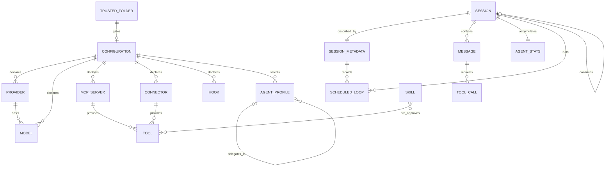

# Entity Model

Mistral Vibe is a command-line coding assistant. It has **no relational database**.
Its "entities" are the domain objects that the system persists to disk (as TOML
configuration, JSON session logs, and metadata files) or holds in memory for the
duration of a session. This model is derived from the Pydantic models and
dataclasses under `vibe/core/` — chiefly `config/_settings.py`, `types.py`,
`agents/models.py`, `hooks/models.py`, and `skills/models.py`.

Because there is no schema migration layer, all "data types" below are mapped
from Python type annotations to the AIUP type vocabulary, and "Primary Key"
denotes the field that uniquely identifies an instance in its store (a config
file, a session directory, or a discovered file on disk) rather than a database
column.

## Entity Relationship Diagram

## Entities

### CONFIGURATION

The complete set of settings that governs a Vibe session, composed by merging
built-in defaults with the user-level and project-level configuration layers.

| Attribute | Description | Data Type | Length/Precision | Validation Rules |
|-----------|-------------|-----------|------------------|------------------|
| source_layer | Which layer this configuration came from (default, user, project) | String | — | Not Null, Values: default, user, project |
| active_model | Alias of the model currently in use | String | — | Not Null |
| default_agent | Agent profile chosen when no `--agent` flag is given | String | — | Not Null |
| enabled_tools | Tool name patterns that are allowed | String | — | Optional |
| disabled_tools | Tool name patterns that are blocked | String | — | Optional |
| bypass_tool_permissions | Whether tool approval prompts are skipped | Boolean | — | Not Null |
| session_logging_enabled | Whether sessions are written to disk | Boolean | — | Not Null |

### PROVIDER

An LLM service endpoint that Vibe can send completions to.

| Attribute | Description | Data Type | Length/Precision | Validation Rules |
|-----------|-------------|-----------|------------------|------------------|
| name | Unique provider alias | String | — | Primary Key |
| api_base | Base URL of the provider's API | String | — | Not Null |
| api_key_env_var | Environment variable holding the API key | String | — | Optional |
| api_style | API dialect spoken by the provider | String | — | Not Null |
| backend | Backend implementation used | String | — | Not Null, Values: mistral, generic |

### MODEL

A specific model offered by a provider, with its sampling and context settings.

| Attribute | Description | Data Type | Length/Precision | Validation Rules |
|-----------|-------------|-----------|------------------|------------------|
| alias | Unique short name used to select the model | String | — | Primary Key |
| name | Provider-side model identifier | String | — | Not Null |
| provider | Provider that hosts the model | String | — | Not Null, Foreign Key (PROVIDER.name) |
| temperature | Sampling temperature | Decimal | — | Not Null |
| thinking | Reasoning effort level | String | — | Not Null, Values: off, low, medium, high, max |
| input_price | Price per million input tokens | Decimal | — | Not Null, Min: 0 |
| output_price | Price per million output tokens | Decimal | — | Not Null, Min: 0 |
| auto_compact_threshold | Context-token count that triggers auto-compaction | Integer | — | Not Null, Min: 0 |

### AGENT_PROFILE

A named bundle of tool permissions and overrides that defines how autonomous the
agent is.

| Attribute | Description | Data Type | Length/Precision | Validation Rules |
|-----------|-------------|-----------|------------------|------------------|
| name | Unique profile identifier | String | — | Primary Key |
| display_name | Human-readable profile name | String | — | Not Null |
| description | What the profile is for | String | — | Not Null |
| safety | Risk level of the profile | String | — | Not Null, Values: safe, neutral, destructive, yolo |
| agent_type | Whether the profile is a top-level agent or a subagent | String | — | Not Null, Values: agent, subagent |
| install_required | Whether the profile must be installed before use | Boolean | — | Not Null |

### SESSION

One conversation between the developer and the agent, optionally persisted to a
session directory.

| Attribute | Description | Data Type | Length/Precision | Validation Rules |
|-----------|-------------|-----------|------------------|------------------|
| session_id | Unique session identifier | String | — | Primary Key |
| parent_session_id | Session this one was resumed or branched from | String | — | Optional, Foreign Key (SESSION.session_id) |
| start_time | When the session began | DateTime | — | Not Null |
| message_count | Number of messages in the session | Integer | — | Not Null, Min: 0 |
| save_dir | Directory the session is stored in | String | — | Not Null |

### SESSION_METADATA

Descriptive information stored alongside a persisted session.

| Attribute | Description | Data Type | Length/Precision | Validation Rules |
|-----------|-------------|-----------|------------------|------------------|
| session_id | The session this metadata describes | String | — | Primary Key, Foreign Key (SESSION.session_id) |
| parent_session_id | Session this one continues | String | — | Optional, Foreign Key (SESSION.session_id) |
| start_time | When the session began | DateTime | — | Not Null |
| end_time | When the session ended | DateTime | — | Optional |
| git_commit | Git commit at session start | String | — | Optional |
| git_branch | Git branch at session start | String | — | Optional |
| username | Operating-system user who ran the session | String | — | Not Null |
| title | Human-readable session title | String | — | Optional |
| title_source | Whether the title was set automatically or by hand | String | — | Not Null, Values: auto, manual |

### MESSAGE

A single entry in a conversation — from the system, the developer, the assistant,
or a tool.

| Attribute | Description | Data Type | Length/Precision | Validation Rules |
|-----------|-------------|-----------|------------------|------------------|
| message_id | Unique message identifier | String | — | Primary Key |
| role | Who produced the message | String | — | Not Null, Values: system, user, assistant, tool |
| content | The message text | String | — | Optional |
| reasoning_content | The model's reasoning text, when present | String | — | Optional |
| name | Tool name, for tool-role messages | String | — | Optional |
| tool_call_id | Tool call this message answers, for tool-role messages | String | — | Optional, Foreign Key (TOOL_CALL.id) |
| injected | Whether the message was injected rather than authored | Boolean | — | Not Null |

### TOOL_CALL

A request by the assistant to run a tool, embedded in an assistant message.

| Attribute | Description | Data Type | Length/Precision | Validation Rules |
|-----------|-------------|-----------|------------------|------------------|
| id | Unique tool-call identifier | String | — | Primary Key |
| index | Position of the call within the assistant message | Integer | — | Optional, Min: 0 |
| function_name | Name of the tool to run | String | — | Not Null |
| arguments | JSON-encoded arguments for the tool | String | — | Optional |

### TOOL

A capability the agent can invoke — built-in, MCP-provided, or connector-provided.

| Attribute | Description | Data Type | Length/Precision | Validation Rules |
|-----------|-------------|-----------|------------------|------------------|
| name | Tool name, prefixed with the server alias for external tools | String | — | Primary Key |
| description | What the tool does and when to use it | String | — | Not Null |
| parameters | JSON schema of the tool's arguments | String | — | Not Null |
| source | Where the tool comes from | String | — | Not Null, Values: builtin, mcp, connector |

### AGENT_STATS

Cumulative usage and cost figures for a session.

| Attribute | Description | Data Type | Length/Precision | Validation Rules |
|-----------|-------------|-----------|------------------|------------------|
| session_id | The session these statistics belong to | String | — | Primary Key, Foreign Key (SESSION.session_id) |
| steps | Number of agent steps taken | Integer | — | Not Null, Min: 0 |
| session_prompt_tokens | Total input tokens used | Integer | — | Not Null, Min: 0 |
| session_completion_tokens | Total output tokens produced | Integer | — | Not Null, Min: 0 |
| context_tokens | Current conversation context size | Integer | — | Not Null, Min: 0 |
| tool_calls_succeeded | Tool calls that completed successfully | Integer | — | Not Null, Min: 0 |
| tool_calls_rejected | Tool calls the developer rejected | Integer | — | Not Null, Min: 0 |
| tool_calls_failed | Tool calls that errored | Integer | — | Not Null, Min: 0 |
| session_cost | Estimated session cost in dollars | Decimal | — | Not Null, Min: 0 |

### SCHEDULED_LOOP

A prompt configured to run automatically at a fixed interval during a session.

| Attribute | Description | Data Type | Length/Precision | Validation Rules |
|-----------|-------------|-----------|------------------|------------------|
| id | Unique loop identifier | String | — | Primary Key |
| interval_seconds | Seconds between runs | Integer | — | Not Null, Min: 1 |
| prompt | The prompt that runs each interval | String | — | Not Null |
| next_fire_at | When the loop fires next | DateTime | — | Not Null |
| created_at | When the loop was created | DateTime | — | Not Null |

### SKILL

A packaged set of instructions and optional pre-approved tools that the agent or
developer can invoke.

| Attribute | Description | Data Type | Length/Precision | Validation Rules |
|-----------|-------------|-----------|------------------|------------------|
| name | Unique skill identifier | String | 1-64 | Primary Key, Format: lowercase letters, numbers, hyphens |
| description | What the skill does and when to use it | String | 1-1024 | Not Null |
| license | License name or bundled license reference | String | — | Optional |
| compatibility | Environment requirements | String | 0-500 | Optional |
| user_invocable | Whether the skill appears in the slash-command menu | Boolean | — | Not Null |
| allowed_tools | Tools the skill pre-approves while running | String | — | Optional |

### MCP_SERVER

An external Model Context Protocol server whose tools are exposed to the agent.

| Attribute | Description | Data Type | Length/Precision | Validation Rules |
|-----------|-------------|-----------|------------------|------------------|
| name | Unique server alias, prefixing its tool names | String | 0-256 | Primary Key, Format: alphanumeric, underscore, hyphen |
| transport | How Vibe connects to the server | String | — | Not Null, Values: stdio, http, streamable-http |
| disabled | Whether all of the server's tools are hidden | Boolean | — | Not Null |
| disabled_tools | Tool names from this server to hide | String | — | Optional |
| sampling_enabled | Whether the server may request LLM completions | Boolean | — | Not Null |
| startup_timeout_sec | Seconds allowed for the server to start | Decimal | — | Not Null, Min: 0 |
| tool_timeout_sec | Seconds allowed for a tool call to finish | Decimal | — | Not Null, Min: 0 |

### CONNECTOR

A managed integration whose tools are exposed to the agent, identified by alias.

| Attribute | Description | Data Type | Length/Precision | Validation Rules |
|-----------|-------------|-----------|------------------|------------------|
| name | Normalized connector alias | String | — | Primary Key |
| disabled | Whether all of the connector's tools are hidden | Boolean | — | Not Null |
| disabled_tools | Tool names from this connector to hide | String | — | Optional |

### HOOK

A user-defined shell command run automatically at a defined point in the agent
lifecycle.

| Attribute | Description | Data Type | Length/Precision | Validation Rules |
|-----------|-------------|-----------|------------------|------------------|
| name | Hook identifier | String | — | Primary Key |
| type | Lifecycle event that triggers the hook | String | — | Not Null, Values: post_agent_turn |
| command | Shell command to run | String | — | Not Null |
| timeout | Seconds allowed for the command to finish | Decimal | — | Not Null, Min: 0 |
| description | What the hook does | String | — | Optional |

### TRUSTED_FOLDER

A working directory and the developer's decision about whether its project-level
configuration may be loaded.

| Attribute | Description | Data Type | Length/Precision | Validation Rules |
|-----------|-------------|-----------|------------------|------------------|
| path | Absolute path of the directory | String | — | Primary Key |
| trusted | Whether the directory is trusted | Boolean | — | Not Null |
| session_only | Whether the trust applies only to the current run | Boolean | — | Not Null |
