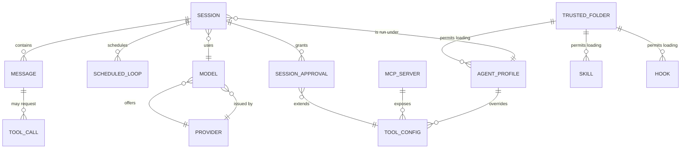

# Entity Model

## Overview

The Mistral Vibe domain centres on the **Session** — a single conversation between a developer and the agent. A session is governed by an **Agent Profile** (which tool set and safety posture it uses) and an active **Model** (which LLM produces responses). Inside a session, the developer and assistant exchange **Messages**; assistant messages can request **Tool Calls** that the system executes after consulting per-tool **Tool Configurations** and any **Session Approval**. The session metadata also tracks **Scheduled Loops** (recurring prompts).

Outside any single session, Vibe persists configuration that the developer authors over time: **Trusted Folders** (which directories may load project-level instructions), **Skills** (reusable prompt templates), **MCP Servers** (external tool providers), **Hooks** (post-turn shell commands), and **Providers** (LLM API endpoints, of which each Model declares one).

Skills, agent profiles, MCP servers, and hooks form the extension surface; sessions and messages form the runtime state.

## Entity-Relationship Diagram

## Entity Catalogue

### SESSION

A single conversation between the developer and the agent, persisted as a metadata file and a message log.

| Attribute | Description | Data Type | Length/Precision | Validation Rules |
|---|---|---|---|---|
| session_id | Stable unique identifier for the session | String | 36 | Primary Key |
| parent_session_id | Identifier of a session this one was forked from | String | 36 | Optional, Foreign Key (SESSION.session_id) |
| start_time | When the session was opened | DateTime | — | Not Null |
| end_time | When the session was closed | DateTime | — | Optional |
| title | Human-readable name for the session | String | 256 | Optional |
| title_source | Whether the title was auto-generated or manually set | String | — | Not Null, Values: auto, manual |
| working_directory | Directory the session was started in | String | 4096 | Not Null |
| git_commit | Git HEAD at session start | String | 40 | Optional |
| git_branch | Git branch at session start | String | 256 | Optional |
| username | Local username of the developer | String | 256 | Not Null |
| agent_profile_name | Name of the active agent profile | String | 64 | Not Null, Foreign Key (AGENT_PROFILE.name) |
| active_model_alias | Alias of the active model | String | 64 | Not Null, Foreign Key (MODEL.alias) |

### MESSAGE

A single turn in the conversation — a user prompt, an assistant reply, a tool call request, or a tool result.

| Attribute | Description | Data Type | Length/Precision | Validation Rules |
|---|---|---|---|---|
| message_id | Stable identifier for this message | String | 36 | Primary Key |
| session_id | Owning session | String | 36 | Not Null, Foreign Key (SESSION.session_id) |
| role | Who produced this message | String | — | Not Null, Values: system, user, assistant, tool |
| content | The message text | String | — | Optional |
| reasoning_content | Chain-of-thought content emitted alongside the reply | String | — | Optional |
| reasoning_signature | Provider-supplied signature for the reasoning block | String | — | Optional |
| injected | Whether this message was inserted by the system (e.g. a hook result) rather than typed by the developer | Boolean | — | Not Null |
| name | Tool name (only set for tool-result messages) | String | 128 | Optional |
| tool_call_id | Identifier of the tool call this message answers | String | 64 | Optional, Foreign Key (TOOL_CALL.tool_call_id) |
| sequence | Position of the message in the session log | Integer | — | Not Null, Min: 0 |

### TOOL_CALL

A request from the assistant to invoke a named tool with specific arguments.

| Attribute | Description | Data Type | Length/Precision | Validation Rules |
|---|---|---|---|---|
| tool_call_id | Identifier supplied by the provider | String | 64 | Primary Key |
| message_id | Assistant message that requested the call | String | 36 | Not Null, Foreign Key (MESSAGE.message_id) |
| index | Position of the call within the message | Integer | — | Not Null, Min: 0 |
| tool_name | Fully qualified tool name (possibly with MCP server prefix) | String | 256 | Not Null |
| arguments | Raw JSON arguments emitted by the assistant | String | — | Not Null |
| permission_resolution | The permission decision at execution time | String | — | Not Null, Values: always, ask, never |
| status | Outcome of the call | String | — | Not Null, Values: succeeded, failed, denied, cancelled |

### AGENT_PROFILE

A persona — a bundle of system prompt, model, and tool overrides — that governs how the agent behaves in a session.

| Attribute | Description | Data Type | Length/Precision | Validation Rules |
|---|---|---|---|---|
| name | Identifier used to select the profile | String | 64 | Primary Key |
| display_name | Human-readable label | String | 128 | Not Null |
| description | One-line summary of what the profile does | String | 512 | Not Null |
| safety | Safety posture of the profile | String | — | Not Null, Values: safe, neutral, destructive, yolo |
| agent_type | Whether the profile can be the primary agent or is a delegate | String | — | Not Null, Values: agent, subagent |
| install_required | Whether the profile must be installed before it becomes available | Boolean | — | Not Null |
| system_prompt_id | Identifier of the system prompt to use | String | 128 | Optional |
| active_model_alias | Default model alias when this profile is active | String | 64 | Optional, Foreign Key (MODEL.alias) |
| bypass_tool_permissions | Whether tool approval prompts are skipped | Boolean | — | Not Null |
| source_path | File the profile was loaded from | String | 4096 | Optional, Foreign Key (TRUSTED_FOLDER.path) for project-level profiles |

### TOOL_CONFIG

The effective configuration for one tool — its permission, allowlist, and denylist — under a given scope (global or per-agent-profile).

| Attribute | Description | Data Type | Length/Precision | Validation Rules |
|---|---|---|---|---|
| tool_name | Fully qualified tool name | String | 256 | Primary Key |
| permission | Default permission for this tool | String | — | Not Null, Values: always, ask, never |
| allowlist | Patterns that automatically allow execution | String | — | Optional |
| denylist | Patterns that automatically deny execution | String | — | Optional |
| sensitive_patterns | Patterns that downgrade an *always* permission back to *ask* | String | — | Optional |
| owning_mcp_server_name | MCP server that exposes this tool, if any | String | 256 | Optional, Foreign Key (MCP_SERVER.name) |
| owning_agent_profile_name | Agent profile that overrides this tool, if scoped | String | 64 | Optional, Foreign Key (AGENT_PROFILE.name) |

### SESSION_APPROVAL

A "remember this approval" rule recorded on a session, allowing future matching tool calls to run without prompting.

| Attribute | Description | Data Type | Length/Precision | Validation Rules |
|---|---|---|---|---|
| session_id | Session the approval belongs to | String | 36 | Not Null, Foreign Key (SESSION.session_id) |
| tool_name | Tool the approval applies to | String | 256 | Not Null, Foreign Key (TOOL_CONFIG.tool_name) |
| scope | Kind of pattern matched | String | — | Not Null, Values: command_pattern, outside_directory, file_pattern, url_pattern |
| pattern | Pattern that grants approval | String | 1024 | Not Null |
| persisted | Whether this approval was also written to the user-level configuration | Boolean | — | Not Null |

### MODEL

A configured LLM, identified by its alias.

| Attribute | Description | Data Type | Length/Precision | Validation Rules |
|---|---|---|---|---|
| alias | Short name used in `active_model` | String | 64 | Primary Key |
| name | Provider-specific model identifier | String | 256 | Not Null |
| provider_name | Provider that serves this model | String | 64 | Not Null, Foreign Key (PROVIDER.name) |
| temperature | Sampling temperature | Decimal | 5,3 | Not Null, Min: 0, Max: 2 |
| input_price | Price per million input tokens (USD) | Decimal | 10,4 | Not Null, Min: 0 |
| output_price | Price per million output tokens (USD) | Decimal | 10,4 | Not Null, Min: 0 |
| thinking | Reasoning effort level | String | — | Not Null, Values: off, low, medium, high |
| auto_compact_threshold | Token count that triggers auto-compaction | Integer | — | Not Null, Min: 1000 |

### PROVIDER

An LLM API endpoint that can serve one or more models.

| Attribute | Description | Data Type | Length/Precision | Validation Rules |
|---|---|---|---|---|
| name | Short alias used by models to reference this provider | String | 64 | Primary Key |
| api_base | Base URL for the provider's API | String | 1024 | Not Null |
| api_key_env_var | Environment variable that holds the API key | String | 128 | Optional |
| api_style | Wire-format the provider expects | String | — | Not Null, Values: openai, ... |
| backend | Internal backend implementation | String | — | Not Null, Values: mistral, generic |
| browser_auth_base_url | Base URL for browser-based sign-in | String | 1024 | Optional |
| browser_auth_api_base_url | API URL for browser-based sign-in | String | 1024 | Optional |
| project_id | Optional project identifier required by some providers | String | 128 | Optional |
| region | Optional region identifier required by some providers | String | 64 | Optional |

### SKILL

A reusable prompt template that the developer (or the assistant) can invoke during a session.

| Attribute | Description | Data Type | Length/Precision | Validation Rules |
|---|---|---|---|---|
| name | Slash-command identifier | String | 64 | Primary Key, Format: lowercase-kebab-case |
| description | What this skill does and when to use it | String | 1024 | Not Null |
| prompt_body | Markdown body inserted into the conversation when invoked | String | — | Not Null |
| license | License name or reference | String | 256 | Optional |
| compatibility | Environment requirements | String | 500 | Optional |
| user_invocable | Whether the skill appears in the slash command menu | Boolean | — | Not Null |
| allowed_tools | Tools pre-approved for the duration of the skill's invocation | String | — | Optional |
| source_path | File system path where the skill is defined | String | 4096 | Not Null |
| trusted_folder_path | Project trust root that permits this skill to load, if project-scoped | String | 4096 | Optional, Foreign Key (TRUSTED_FOLDER.path) |

### MCP_SERVER

An external Model Context Protocol server that contributes additional tools to a session.

| Attribute | Description | Data Type | Length/Precision | Validation Rules |
|---|---|---|---|---|
| name | Alias used as the prefix for the server's tool names | String | 256 | Primary Key, Format: alphanumeric, underscore, hyphen |
| transport | Wire transport for this server | String | — | Not Null, Values: http, streamable-http, stdio |
| url | Base URL for HTTP transports | String | 1024 | Optional |
| command | Command to spawn for stdio transport | String | 1024 | Optional |
| disabled | Whether the entire server is suppressed | Boolean | — | Not Null |
| disabled_tools | Tool names to hide from this server | String | — | Optional |
| startup_timeout_sec | Maximum seconds the server has to initialise | Decimal | 6,2 | Not Null, Min: 0.01 |
| tool_timeout_sec | Maximum seconds for a tool call | Decimal | 6,2 | Not Null, Min: 0.01 |
| sampling_enabled | Whether the server may request LLM completions | Boolean | — | Not Null |
| api_key_env | Environment variable that holds the API token (HTTP only) | String | 128 | Optional |
| api_key_header | HTTP header name used to send the token | String | 128 | Optional |
| api_key_format | Format string used to build the header value | String | 256 | Optional |
| prompt | Usage hint appended to the server's tool descriptions | String | 1024 | Optional |

### TRUSTED_FOLDER

A directory the developer has classified as trusted or untrusted; controls whether project-level instructions, agent profiles, skills, and hooks may load.

| Attribute | Description | Data Type | Length/Precision | Validation Rules |
|---|---|---|---|---|
| path | Absolute path to the directory | String | 4096 | Primary Key |
| state | Trust decision | String | — | Not Null, Values: trusted, untrusted |
| scope | Whether the decision is persisted or session-only | String | — | Not Null, Values: persisted, session |

### HOOK

A shell command Vibe runs at a defined point in the agent lifecycle (currently: after each assistant turn).

| Attribute | Description | Data Type | Length/Precision | Validation Rules |
|---|---|---|---|---|
| name | Identifier for the hook | String | 128 | Primary Key |
| type | Event the hook listens for | String | — | Not Null, Values: post_agent_turn |
| command | Shell command line to execute | String | 4096 | Not Null |
| timeout | Maximum seconds the hook is allowed to run | Decimal | 6,2 | Not Null, Min: 0.01 |
| description | Optional human-readable note | String | 1024 | Optional |
| trusted_folder_path | Project trust root that permits this hook to load, if project-scoped | String | 4096 | Optional, Foreign Key (TRUSTED_FOLDER.path) |

### SCHEDULED_LOOP

A prompt the session re-runs at a fixed interval.

| Attribute | Description | Data Type | Length/Precision | Validation Rules |
|---|---|---|---|---|
| id | Stable identifier within the session | String | 32 | Primary Key |
| session_id | Owning session | String | 36 | Not Null, Foreign Key (SESSION.session_id) |
| interval_seconds | Number of seconds between firings | Integer | — | Not Null, Min: 30 |
| prompt | Prompt text to inject when the loop fires | String | — | Not Null |
| next_fire_at | Epoch time of the next scheduled firing | Decimal | 14,3 | Not Null, Min: 0 |
| created_at | Epoch time when the loop was created | Decimal | 14,3 | Not Null, Min: 0 |
