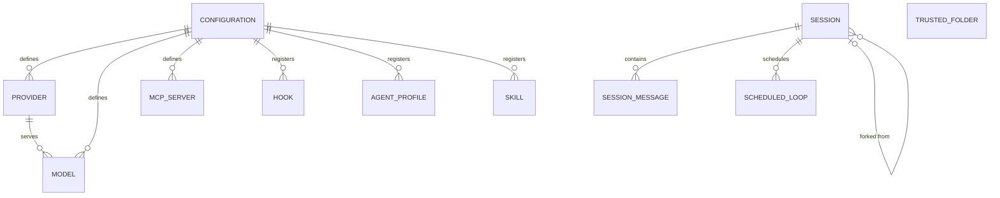

# Entity Model

Mistral Vibe stores no relational database. Its persistent domain data lives
in configuration files (built-in defaults, user, and project layers) and in
per-session log directories. The entities below are recovered from those
configuration schemas and session records.

## ER Diagram

## Entities

### CONFIGURATION

The merged set of settings that governs how Mistral Vibe behaves in a session.

| Attribute | Description | Data Type | Length/Precision | Validation Rules |
|-----------|-------------|-----------|------------------|------------------|
| active_model | Alias of the model used for agent turns | String | — | Not Null |
| default_agent | Agent mode used when none is named explicitly | String | — | Not Null |
| system_prompt_id | Identifier of the system prompt to load | String | — | Not Null |
| auto_compact_threshold | Token count that triggers automatic compaction | Integer | — | Not Null, Min: 1 |
| api_timeout | Timeout for model API calls, in seconds | Decimal | — | Not Null |
| bypass_tool_permissions | Whether tool actions skip the approval step | Boolean | — | Not Null |
| enable_telemetry | Whether usage telemetry is sent | Boolean | — | Not Null |
| voice_mode_enabled | Whether voice input is enabled | Boolean | — | Not Null |
| narrator_enabled | Whether spoken narration is enabled | Boolean | — | Not Null |
| vibe_code_enabled | Whether Vibe Code teleport is enabled | Boolean | — | Not Null |

### PROVIDER

An external endpoint that serves language-model completions to the agent.

| Attribute | Description | Data Type | Length/Precision | Validation Rules |
|-----------|-------------|-----------|------------------|------------------|
| name | Unique alias of the provider | String | — | Not Null, Unique |
| api_base | Base URL of the provider's API | String | — | Not Null |
| api_key_env_var | Environment variable that holds the API key | String | — | Optional |
| api_style | Wire format the provider speaks | String | — | Not Null |
| backend | Backend family the provider belongs to | String | — | Not Null, Values: mistral, generic |
| region | Cloud region, when the provider needs one | String | — | Optional |
| project_id | Cloud project identifier, when the provider needs one | String | — | Optional |

### MODEL

A language-model configuration the Developer can make active.

| Attribute | Description | Data Type | Length/Precision | Validation Rules |
|-----------|-------------|-----------|------------------|------------------|
| name | Provider-side model name | String | — | Not Null |
| alias | Short name used to select the model | String | — | Not Null, Unique |
| provider | Provider that serves the model | String | — | Not Null, Foreign Key (PROVIDER.name) |
| temperature | Sampling temperature | Decimal | — | Not Null |
| thinking | Reasoning effort level | String | — | Not Null, Values: off, low, medium, high, max |
| input_price | Price per million input tokens | Decimal | — | Not Null, Min: 0 |
| output_price | Price per million output tokens | Decimal | — | Not Null, Min: 0 |
| auto_compact_threshold | Token count that triggers compaction for this model | Integer | — | Not Null, Min: 1 |

### AGENT_PROFILE

A named operating mode that sets how autonomously the agent acts.

| Attribute | Description | Data Type | Length/Precision | Validation Rules |
|-----------|-------------|-----------|------------------|------------------|
| name | Unique identifier of the mode | String | — | Primary Key |
| display_name | Human-readable name of the mode | String | — | Not Null |
| description | What the mode is for | String | — | Not Null |
| safety | Safety level of the mode | String | — | Not Null, Values: safe, neutral, destructive, yolo |
| agent_type | Whether the mode is a top-level agent or a subagent | String | — | Not Null, Values: agent, subagent |
| install_required | Whether the mode must be installed before it can be used | Boolean | — | Not Null |

### MCP_SERVER

An external Model Context Protocol server that supplies extra tools.

| Attribute | Description | Data Type | Length/Precision | Validation Rules |
|-----------|-------------|-----------|------------------|------------------|
| name | Short alias prefixed onto the server's tool names | String | 256 | Not Null, Unique |
| transport | How the server is reached | String | — | Not Null, Values: http, streamable-http, stdio |
| prompt | Optional usage hint added to tool descriptions | String | — | Optional |
| startup_timeout_sec | Time allowed for the server to start, in seconds | Decimal | — | Not Null, Min: 0 |
| tool_timeout_sec | Time allowed for a single tool call, in seconds | Decimal | — | Not Null, Min: 0 |
| disabled | Whether the server's tools are hidden from the agent | Boolean | — | Not Null |
| sampling_enabled | Whether the server may request model completions | Boolean | — | Not Null |

### HOOK

A shell command the system runs automatically on a session lifecycle event.

| Attribute | Description | Data Type | Length/Precision | Validation Rules |
|-----------|-------------|-----------|------------------|------------------|
| name | Identifier of the hook | String | — | Not Null |
| type | Lifecycle event that triggers the hook | String | — | Not Null, Values: post_agent_turn |
| command | Shell command to run | String | — | Not Null |
| timeout | Time allowed for the hook to run, in seconds | Decimal | — | Not Null |
| description | What the hook does | String | — | Optional |

### SKILL

A packaged, reusable workflow the agent or the Developer can invoke.

| Attribute | Description | Data Type | Length/Precision | Validation Rules |
|-----------|-------------|-----------|------------------|------------------|
| name | Skill identifier | String | — | Not Null, Unique |
| description | What the skill does and when to use it | String | — | Not Null |
| license | License name or reference for the skill | String | — | Optional |
| skill_path | Location of the skill definition on disk | String | — | Optional |

### SESSION

One coding conversation, saved with its history and metadata.

| Attribute | Description | Data Type | Length/Precision | Validation Rules |
|-----------|-------------|-----------|------------------|------------------|
| session_id | Unique identifier of the session | String | — | Primary Key |
| parent_session_id | Session this one was forked from | String | — | Optional, Foreign Key (SESSION.session_id) |
| start_time | When the session began | DateTime | — | Not Null |
| end_time | When the session ended | DateTime | — | Optional |
| git_commit | Commit checked out when the session ran | String | — | Optional |
| git_branch | Branch checked out when the session ran | String | — | Optional |
| username | User who ran the session | String | — | Not Null |
| title | Human-readable session title | String | — | Optional |
| title_source | Whether the title was set automatically or by hand | String | — | Not Null, Values: auto, manual |

### SESSION_MESSAGE

One message in a session's conversation history.

| Attribute | Description | Data Type | Length/Precision | Validation Rules |
|-----------|-------------|-----------|------------------|------------------|
| message_id | Identifier of the message | String | — | Optional |
| role | Who produced the message | String | — | Not Null, Values: system, user, assistant, tool |
| content | Text of the message | String | — | Optional |
| reasoning_content | Model reasoning attached to the message | String | — | Optional |
| name | Tool name, for tool result messages | String | — | Optional |
| tool_call_id | Tool call this message answers | String | — | Optional |
| injected | Whether the system inserted the message rather than the user | Boolean | — | Not Null |

### SCHEDULED_LOOP

A prompt set to run automatically at a fixed interval within a session.

| Attribute | Description | Data Type | Length/Precision | Validation Rules |
|-----------|-------------|-----------|------------------|------------------|
| id | Identifier of the loop | String | — | Primary Key |
| interval_seconds | Seconds between runs | Integer | — | Not Null, Min: 1 |
| prompt | Prompt to run on each fire | String | — | Not Null |
| next_fire_at | When the loop runs next | DateTime | — | Not Null |
| created_at | When the loop was created | DateTime | — | Not Null |

### TRUSTED_FOLDER

A directory together with the Developer's recorded decision to trust it.

| Attribute | Description | Data Type | Length/Precision | Validation Rules |
|-----------|-------------|-----------|------------------|------------------|
| path | Absolute path of the directory | String | — | Primary Key |
| trusted | Whether the agent may load behaviour files from the directory | Boolean | — | Not Null |
