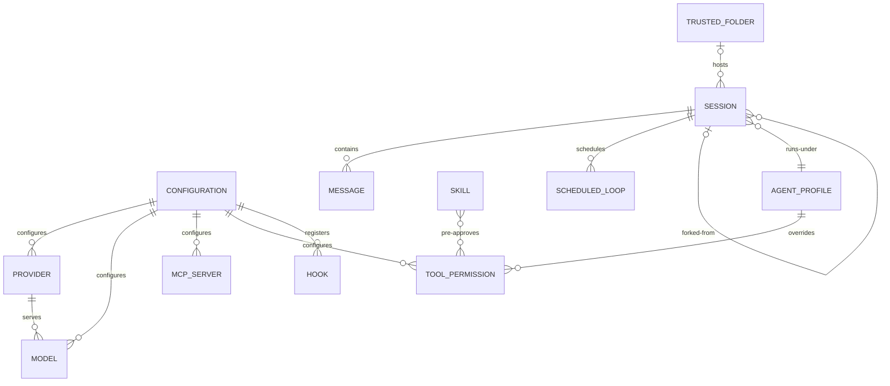

# Entity Model

This entity model is reverse-engineered from the Mistral Vibe codebase. Vibe is
a local CLI application with no relational database; its "entities" are the
persisted domain objects stored as TOML/JSON files on disk (`config.toml`,
`trusted_folders.toml`, session logs) and the in-memory models that drive the
agent. Types and validation rules are recovered from the Pydantic models and
their validators.

## Entity Relationship Diagram

## Entities

### CONFIGURATION

The user- and project-level settings that govern how Vibe behaves, persisted as
`config.toml` and layered across the user home and project directories.

| Attribute | Description | Data Type | Length/Precision | Validation Rules |
|-----------|-------------|-----------|------------------|------------------|
| active_model | Alias of the model the agent currently uses | String | — | Not Null |
| system_prompt_id | Identifier of the system prompt to load | String | — | Not Null |
| default_agent | Agent profile used when no agent is selected | String | — | Not Null |
| api_timeout | Maximum time to wait for a model response | Decimal | seconds | Not Null |
| auto_compact_threshold | Token count that triggers automatic compaction | Integer | — | Not Null |
| bypass_tool_permissions | Whether tool executions skip approval | Boolean | — | Not Null |
| enable_telemetry | Whether usage telemetry is sent | Boolean | — | Not Null |
| enable_auto_update | Whether Vibe updates itself automatically | Boolean | — | Not Null |
| enable_notifications | Whether desktop notifications are shown | Boolean | — | Not Null |
| voice_mode_enabled | Whether voice dictation is active | Boolean | — | Not Null |
| enabled_tools | Tool name patterns to allow exclusively | String (list) | — | Optional |
| disabled_tools | Tool name patterns to hide | String (list) | — | Optional |
| vibe_code_enabled | Whether cloud teleport features are available | Boolean | — | Not Null |

### PROVIDER

An LLM service endpoint that Vibe can send completion requests to.

| Attribute | Description | Data Type | Length/Precision | Validation Rules |
|-----------|-------------|-----------|------------------|------------------|
| name | Provider identifier referenced by models | String | — | Not Null, Unique |
| api_base | Base URL of the provider's API | String | — | Not Null |
| api_key_env_var | Environment variable holding the API key | String | — | Optional |
| backend | Backend implementation to use | String | — | Not Null, Values: mistral, generic |
| api_style | Request/response format style | String | — | Not Null |
| region | Cloud region for the provider | String | — | Optional |
| project_id | Cloud project identifier for the provider | String | — | Optional |

### MODEL

A specific model offered by a provider, selectable as the active model.

| Attribute | Description | Data Type | Length/Precision | Validation Rules |
|-----------|-------------|-----------|------------------|------------------|
| alias | Short name used to select the model | String | — | Not Null, Unique |
| name | Provider-side model name | String | — | Not Null |
| provider | Provider that serves this model | String | — | Not Null, Foreign Key (PROVIDER.name) |
| temperature | Sampling temperature for generation | Decimal | — | Not Null |
| input_price | Cost per million input tokens | Decimal | USD | Not Null |
| output_price | Cost per million output tokens | Decimal | USD | Not Null |
| thinking | Reasoning effort level | String | — | Not Null, Values: off, low, medium, high, max |
| auto_compact_threshold | Token count that triggers compaction for this model | Integer | — | Not Null |

### MCP_SERVER

A Model Context Protocol server registered to extend Vibe with external tools.

| Attribute | Description | Data Type | Length/Precision | Validation Rules |
|-----------|-------------|-----------|------------------|------------------|
| name | Short alias used to prefix the server's tool names | String | Max: 256 | Not Null |
| transport | Connection transport for the server | String | — | Not Null, Values: http, streamable-http, stdio |
| url | Base URL for HTTP-based transports | String | — | Optional |
| command | Command launched for the stdio transport | String | — | Optional |
| disabled | Whether all tools from this server are hidden | Boolean | — | Not Null |
| startup_timeout_sec | Time allowed for the server to start | Decimal | seconds | Not Null, Min: greater than 0 |
| tool_timeout_sec | Time allowed for a tool to execute | Decimal | seconds | Not Null, Min: greater than 0 |
| sampling_enabled | Whether the server may request model completions | Boolean | — | Not Null |

### TOOL_PERMISSION

The approval policy and allowlist configured for an individual tool.

| Attribute | Description | Data Type | Length/Precision | Validation Rules |
|-----------|-------------|-----------|------------------|------------------|
| tool_name | Name of the tool the policy applies to | String | — | Not Null, Unique |
| permission | Approval policy for the tool | String | — | Optional, Values: ask, always, never |
| allowlist | Patterns pre-approved without prompting | String (list) | — | Optional |

### HOOK

A user-defined shell command run automatically in response to an agent event.

| Attribute | Description | Data Type | Length/Precision | Validation Rules |
|-----------|-------------|-----------|------------------|------------------|
| name | Identifier of the hook | String | — | Not Null |
| type | Event that triggers the hook | String | — | Not Null, Values: post_agent_turn |
| command | Shell command executed when the hook fires | String | — | Not Null |
| timeout | Time allowed for the hook to run | Decimal | seconds | Not Null |
| description | Human-readable explanation of the hook | String | — | Optional |

### AGENT_PROFILE

A named behavior preset that overrides configuration to define what the agent
may do without approval (for example `default`, `plan`, `auto-approve`).

| Attribute | Description | Data Type | Length/Precision | Validation Rules |
|-----------|-------------|-----------|------------------|------------------|
| name | Profile identifier selected with the agent flag | String | — | Not Null, Unique |
| display_name | Human-readable profile name | String | — | Not Null |
| description | Explanation of the profile's purpose | String | — | Optional |
| safety | Risk level of the profile's auto-approvals | String | — | Not Null, Values: safe, neutral, destructive, yolo |
| agent_type | Whether the profile is a top-level agent or a subagent | String | — | Not Null, Values: agent, subagent |
| install_required | Whether the profile must be explicitly installed first | Boolean | — | Not Null |
| overrides | Configuration values the profile replaces | String (map) | — | Optional |

### SKILL

A reusable extension package that can add a custom slash command and
specialized agent instructions, declared by a `SKILL.md` file.

| Attribute | Description | Data Type | Length/Precision | Validation Rules |
|-----------|-------------|-----------|------------------|------------------|
| name | Skill identifier | String | Length: 1-64 | Not Null, Unique, Format: lowercase letters, numbers, hyphens |
| description | What the skill does and when to use it | String | Length: 1-1024 | Not Null |
| license | License name or bundled license reference | String | — | Optional |
| compatibility | Environment requirements for the skill | String | Max: 500 | Optional |
| allowed_tools | Tools pre-approved while the skill runs | String (list) | — | Optional |
| user_invocable | Whether the skill appears as a slash command | Boolean | — | Not Null |
| skill_path | Filesystem location of the skill definition | String | — | Optional |

### SESSION

A recorded conversation between a developer and the agent, persisted so it can
be continued or resumed later.

| Attribute | Description | Data Type | Length/Precision | Validation Rules |
|-----------|-------------|-----------|------------------|------------------|
| session_id | Unique identifier of the session | String | — | Not Null, Unique |
| parent_session_id | Session this one was forked or resumed from | String | — | Optional, Foreign Key (SESSION.session_id) |
| start_time | When the session began | DateTime | — | Not Null |
| end_time | When the session ended | DateTime | — | Optional |
| git_commit | Repository commit at session start | String | — | Optional |
| git_branch | Repository branch at session start | String | — | Optional |
| working_directory | Directory the session ran in | String | — | Not Null |
| username | Operating-system user who ran the session | String | — | Not Null |
| title | Short descriptive label for the session | String | Max: 50 | Optional |
| title_source | Whether the title was generated or set by the user | String | — | Not Null, Values: auto, manual |

### MESSAGE

A single turn in a session's conversation, written by the developer, the agent,
or a tool.

| Attribute | Description | Data Type | Length/Precision | Validation Rules |
|-----------|-------------|-----------|------------------|------------------|
| message_id | Unique identifier of the message | String | — | Optional |
| role | Origin of the message | String | — | Not Null, Values: system, user, assistant, tool |
| content | Text body of the message | String | — | Optional |
| reasoning_content | Model reasoning trace attached to the message | String | — | Optional |
| tool_call_id | Tool call this message responds to | String | — | Optional |
| name | Name of the tool that produced the message | String | — | Optional |
| injected | Whether the message was inserted by the system | Boolean | — | Not Null |

### SCHEDULED_LOOP

A recurring prompt registered within a session that the scheduler re-submits at
a fixed interval.

| Attribute | Description | Data Type | Length/Precision | Validation Rules |
|-----------|-------------|-----------|------------------|------------------|
| id | Unique identifier of the scheduled loop | String | — | Not Null, Unique |
| interval_seconds | How often the prompt is re-submitted | Integer | seconds | Not Null, Min: 1 |
| prompt | Text submitted to the agent on each fire | String | — | Not Null |
| next_fire_at | When the loop will next run | DateTime | epoch seconds | Not Null |
| created_at | When the loop was registered | DateTime | epoch seconds | Not Null |

### TRUSTED_FOLDER

A recorded decision about whether a project directory is trusted to load its
local configuration and skills.

| Attribute | Description | Data Type | Length/Precision | Validation Rules |
|-----------|-------------|-----------|------------------|------------------|
| path | Absolute path of the directory | String | — | Not Null, Unique |
| trust_state | Whether the directory is trusted or untrusted | String | — | Not Null, Values: trusted, untrusted |
