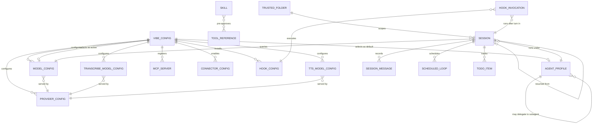

# Entity Model

## Entities

### VIBE_CONFIG

The single, authoritative runtime configuration for a Vibe installation, loaded from `config.toml` in the Vibe home directory and overlaid with `VIBE_*` environment variables.

| Attribute | Description | Data Type | Length/Precision | Validation Rules |
|---|---|---|---|---|
| active_model | Alias of the model used for the main conversation | String | 64 | Not Null |
| default_agent | Agent profile used when no `--agent` flag is given | String | 64 | Not Null |
| system_prompt_id | Identifier of the system prompt template | String | 64 | Not Null |
| auto_compact_threshold | Token count at which automatic compaction is triggered | Integer | — | Not Null, Min: 0 |
| api_timeout | Maximum time to wait for a model response | Decimal | 6,2 | Not Null, Min: 0 |
| vim_keybindings | Whether the input box uses Vim keybindings | Boolean | — | Not Null |
| autocopy_to_clipboard | Whether the last assistant reply is copied to the clipboard automatically | Boolean | — | Not Null |
| context_warnings | Whether to warn the developer as the context window fills | Boolean | — | Not Null |
| voice_mode_enabled | Whether voice input is allowed | Boolean | — | Not Null |
| narrator_enabled | Whether the assistant's replies are read aloud | Boolean | — | Not Null |
| active_transcribe_model | Alias of the model used for speech-to-text | String | 64 | Not Null |
| active_tts_model | Alias of the model used for text-to-speech | String | 64 | Not Null |
| bypass_tool_permissions | Whether tool permission checks are skipped | Boolean | — | Not Null |
| enable_telemetry | Whether usage events are sent to the Mistral datalake | Boolean | — | Not Null |
| enable_update_checks | Whether the client checks for new versions | Boolean | — | Not Null |
| enable_auto_update | Whether new versions are installed automatically | Boolean | — | Not Null |
| enable_notifications | Whether system notifications may be shown | Boolean | — | Not Null |
| enabled_tools | Allowlist of tool name patterns | String | — | Optional |
| disabled_tools | Denylist of tool name patterns | String | — | Optional |
| enabled_agents | Allowlist of agent name patterns | String | — | Optional |
| disabled_agents | Denylist of agent name patterns | String | — | Optional |
| installed_agents | Opt-in built-in agents that have been activated | String | — | Optional |
| enabled_skills | Allowlist of skill name patterns | String | — | Optional |
| disabled_skills | Denylist of skill name patterns | String | — | Optional |
| skill_paths | Extra directories to scan for skills | String | — | Optional |
| agent_paths | Extra directories to scan for agent profiles | String | — | Optional |
| tool_paths | Extra directories to scan for custom tools | String | — | Optional |
| include_commit_signature | Whether commits made by the assistant carry an attribution trailer | Boolean | — | Not Null |
| include_project_context | Whether project-context files are loaded into the system prompt | Boolean | — | Not Null |

### PROVIDER_CONFIG

An LLM provider that Vibe can talk to (Mistral, generic OpenAI-compatible endpoints, and so on).

| Attribute | Description | Data Type | Length/Precision | Validation Rules |
|---|---|---|---|---|
| name | Unique provider identifier | String | 64 | Not Null, Unique |
| api_base | Base URL the provider's API responds on | String | 512 | Not Null, Format: URL |
| api_key_env_var | Environment variable that holds the API key | String | 64 | Optional |
| browser_auth_base_url | Console URL used for browser sign-in | String | 512 | Optional, Format: URL |
| browser_auth_api_base_url | API URL used to complete browser sign-in | String | 512 | Optional, Format: URL |
| api_style | Wire format used to call the provider | String | 32 | Not Null, Values: openai |
| backend | Provider backend kind | String | 32 | Not Null, Values: generic, mistral |
| reasoning_field_name | Field name where the provider returns reasoning content | String | 64 | Not Null |
| project_id | Optional project scope sent with each call | String | 128 | Optional |
| region | Optional region routing hint | String | 64 | Optional |
| extra_headers | Additional headers attached to every request | String | — | Optional |

### MODEL_CONFIG

A model alias that the conversation can use; bound to one provider.

| Attribute | Description | Data Type | Length/Precision | Validation Rules |
|---|---|---|---|---|
| name | Model name as accepted by the provider | String | 128 | Not Null |
| provider | Name of the provider that serves this model | String | 64 | Not Null, Foreign Key (PROVIDER_CONFIG.name) |
| alias | Short name shown in the UI and used by `active_model` | String | 64 | Not Null, Unique |
| temperature | Sampling temperature passed to the provider | Decimal | 4,2 | Not Null, Min: 0, Max: 2 |
| input_price | Dollar cost per million input tokens | Decimal | 10,4 | Not Null, Min: 0 |
| output_price | Dollar cost per million output tokens | Decimal | 10,4 | Not Null, Min: 0 |
| thinking | Reasoning level requested from the model | String | 8 | Not Null, Values: off, low, medium, high, max |
| auto_compact_threshold | Token count at which automatic compaction triggers for this model | Integer | — | Not Null, Min: 0 |

### TRANSCRIBE_MODEL_CONFIG

A speech-to-text model used by the voice input feature.

| Attribute | Description | Data Type | Length/Precision | Validation Rules |
|---|---|---|---|---|
| name | Model name accepted by the transcription provider | String | 128 | Not Null |
| provider | Provider that serves the transcribe model | String | 64 | Not Null, Foreign Key (PROVIDER_CONFIG.name) |
| alias | Short alias used by `active_transcribe_model` | String | 64 | Not Null, Unique |
| sample_rate | Microphone sample rate in Hertz | Integer | — | Not Null, Values: 16000 |
| encoding | Audio frame encoding | String | 16 | Not Null, Values: pcm_s16le |
| language | Spoken language code | String | 8 | Not Null |
| target_streaming_delay_ms | Target latency between audio frame and partial transcript | Integer | — | Not Null, Min: 0 |

### TTS_MODEL_CONFIG

A text-to-speech model used by the narrator feature.

| Attribute | Description | Data Type | Length/Precision | Validation Rules |
|---|---|---|---|---|
| name | Model name accepted by the TTS provider | String | 128 | Not Null |
| provider | Provider that serves the TTS model | String | 64 | Not Null, Foreign Key (PROVIDER_CONFIG.name) |
| alias | Short alias used by `active_tts_model` | String | 64 | Not Null, Unique |
| voice | Voice identifier to use when synthesising | String | 64 | Optional |

### AGENT_PROFILE

A named bundle of behavior overrides (tool allow/deny, model overrides, safety class) that defines how the assistant operates in a session.

| Attribute | Description | Data Type | Length/Precision | Validation Rules |
|---|---|---|---|---|
| name | Profile identifier | String | 64 | Not Null, Unique |
| display_name | Human-readable name shown in the UI | String | 128 | Not Null |
| description | One-sentence summary of how the profile behaves | String | 512 | Not Null |
| safety | How aggressive the profile is about running tools without confirmation | String | 16 | Not Null, Values: safe, neutral, destructive, yolo |
| agent_type | Whether the profile can run as a main session or only as a subagent | String | 16 | Not Null, Values: agent, subagent |
| overrides | Configuration patches deep-merged onto the base `VIBE_CONFIG` | String | — | Optional |
| install_required | Whether the user must explicitly opt in to use this built-in profile | Boolean | — | Not Null |

### SKILL

A reusable prompt — distributed as a `SKILL.md` file — that the developer can invoke through the slash-command menu or that the assistant can invoke through the `skill` tool.

| Attribute | Description | Data Type | Length/Precision | Validation Rules |
|---|---|---|---|---|
| name | Skill identifier | String | 64 | Not Null, Unique, Format: lowercase-kebab |
| description | One-sentence description of what the skill does and when to use it | String | 1024 | Not Null |
| license | License name or reference to a bundled license file | String | 256 | Optional |
| compatibility | Environment requirements such as target product or system packages | String | 500 | Optional |
| metadata | Arbitrary key-value metadata declared in the skill frontmatter | String | — | Optional |
| allowed_tools | Space-delimited list of tools pre-approved while the skill is running | String | — | Optional |
| user_invocable | Whether the skill appears in the slash-command menu | Boolean | — | Not Null |
| prompt | The Markdown prompt body executed when the skill is invoked | String | — | Not Null |
| skill_path | Filesystem path the skill was loaded from | String | 1024 | Optional |

### MCP_SERVER

An external Model Context Protocol server whose tools are exposed to the assistant.

| Attribute | Description | Data Type | Length/Precision | Validation Rules |
|---|---|---|---|---|
| name | Short alias used to prefix every tool from this server | String | 256 | Not Null, Unique |
| transport | Wire transport used to talk to the server | String | 32 | Not Null, Values: stdio, http, streamable-http |
| prompt | Optional usage hint appended to every tool description | String | 1024 | Optional |
| startup_timeout_sec | Maximum time to wait for the server to initialize | Decimal | 6,2 | Not Null, Min: 0 |
| tool_timeout_sec | Maximum time to wait for a tool call to return | Decimal | 6,2 | Not Null, Min: 0 |
| sampling_enabled | Whether the server may request LLM completions via sampling/createMessage | Boolean | — | Not Null |
| disabled | Whether the server's tools are hidden | Boolean | — | Not Null |
| disabled_tools | Specific tool names from this server to hide | String | — | Optional |
| command | Process command (stdio transport only) | String | 1024 | Optional |
| args | Process arguments (stdio transport only) | String | — | Optional |
| env | Environment variables for the spawned process (stdio transport only) | String | — | Optional |
| cwd | Working directory for the spawned process (stdio transport only) | String | 1024 | Optional |
| url | HTTP base URL (HTTP transports only) | String | 512 | Optional, Format: URL |
| headers | Static HTTP headers (HTTP transports only) | String | — | Optional |
| api_key_env | Environment variable carrying the bearer token (HTTP transports only) | String | 64 | Optional |
| api_key_header | HTTP header into which the token is injected | String | 64 | Optional |
| api_key_format | Format string applied to the token before injection | String | 64 | Optional |

### CONNECTOR_CONFIG

A hosted Mistral connector that exposes a remote tool set into the assistant.

| Attribute | Description | Data Type | Length/Precision | Validation Rules |
|---|---|---|---|---|
| name | Normalized connector alias matched against the catalog | String | 256 | Not Null, Unique |
| disabled | Whether the connector's tools are hidden | Boolean | — | Not Null |
| disabled_tools | Specific tool names from this connector to hide | String | — | Optional |

### HOOK_CONFIG

A user-defined shell command that runs after every assistant turn in a session.

| Attribute | Description | Data Type | Length/Precision | Validation Rules |
|---|---|---|---|---|
| name | Hook identifier | String | 64 | Not Null |
| type | When the hook fires | String | 32 | Not Null, Values: post_agent_turn |
| command | Shell command to run | String | 4096 | Not Null |
| timeout | Maximum time the hook is allowed to run | Decimal | 6,2 | Not Null, Min: 0 |
| description | Free-form description shown in `/help` and logs | String | 512 | Optional |

### HOOK_INVOCATION

A single execution of a hook against the current session.

| Attribute | Description | Data Type | Length/Precision | Validation Rules |
|---|---|---|---|---|
| session_id | Session in which the hook fired | String | 36 | Not Null, Foreign Key (SESSION.session_id) |
| transcript_path | Path to the session's transcript at the moment the hook ran | String | 1024 | Not Null |
| cwd | Working directory the hook ran in | String | 1024 | Not Null |
| hook_event_name | Name of the event that triggered the hook | String | 64 | Not Null |

### TRUSTED_FOLDER

A user decision recording whether Vibe is allowed to load agent-behavior files from a directory subtree.

| Attribute | Description | Data Type | Length/Precision | Validation Rules |
|---|---|---|---|---|
| path | Absolute filesystem path the decision applies to | String | 1024 | Not Null, Unique |
| trust_state | Whether the subtree is trusted, untrusted, or trusted only for this session | String | 32 | Not Null, Values: trusted, untrusted, session_trusted |

### SESSION

A single, persisted conversation between a developer (or programmatic caller) and the assistant.

| Attribute | Description | Data Type | Length/Precision | Validation Rules |
|---|---|---|---|---|
| session_id | Globally unique identifier for the session | String | 36 | Primary Key, Format: UUID |
| parent_session_id | Identifier of the session this one was resumed or forked from | String | 36 | Optional, Foreign Key (SESSION.session_id) |
| start_time | When the session began | DateTime | — | Not Null |
| end_time | When the session ended | DateTime | — | Optional |
| git_commit | Commit hash of the working tree at session start | String | 40 | Optional |
| git_branch | Branch checked out at session start | String | 256 | Optional |
| working_directory | Filesystem path the session ran in | String | 1024 | Not Null |
| username | Local OS user who owned the process | String | 64 | Not Null |
| title | Human-readable title of the session | String | 256 | Optional |
| title_source | Whether the title was set automatically or by the user | String | 16 | Not Null, Values: auto, manual |

### SESSION_MESSAGE

A single entry in a session's `messages.jsonl` transcript.

| Attribute | Description | Data Type | Length/Precision | Validation Rules |
|---|---|---|---|---|
| message_id | Unique identifier for the message | String | 36 | Primary Key, Format: UUID |
| session_id | Session the message belongs to | String | 36 | Not Null, Foreign Key (SESSION.session_id) |
| role | Who the message is from | String | 16 | Not Null, Values: system, user, assistant, tool |
| content | Text body of the message | String | — | Optional |
| reasoning_content | Chain-of-thought emitted by the model | String | — | Optional |
| reasoning_signature | Signature used to verify reasoning_content authenticity | String | 256 | Optional |
| tool_calls | Tool calls requested by an assistant message | String | — | Optional |
| tool_call_id | Tool call this message is the result of (tool role only) | String | 64 | Optional |
| name | Tool name (tool role) or function name (assistant role) | String | 256 | Optional |
| injected | Whether the message was synthetically injected (compaction, hook) | Boolean | — | Not Null |

### TODO_ITEM

An entry in the assistant's current task list, owned by exactly one session.

| Attribute | Description | Data Type | Length/Precision | Validation Rules |
|---|---|---|---|---|
| id | Identifier unique within the session | String | 64 | Primary Key |
| session_id | Session that owns the todo list | String | 36 | Not Null, Foreign Key (SESSION.session_id) |
| content | The thing to be done | String | 1024 | Not Null |
| status | Current state of the item | String | 16 | Not Null, Values: pending, in_progress, completed, cancelled |
| priority | How important the item is | String | 8 | Not Null, Values: low, medium, high |

### SCHEDULED_LOOP

A recurring prompt registered via `/loop` and active for the duration of a session.

| Attribute | Description | Data Type | Length/Precision | Validation Rules |
|---|---|---|---|---|
| id | Identifier unique within the session | String | 64 | Primary Key |
| session_id | Session that owns the loop | String | 36 | Not Null, Foreign Key (SESSION.session_id) |
| interval_seconds | Time between iterations | Integer | — | Not Null, Min: 1 |
| prompt | Prompt or slash command submitted on each tick | String | 4096 | Not Null |
| iterations | Number of times the loop has fired so far | Integer | — | Not Null, Min: 0 |

### TOOL_REFERENCE

A by-name reference to a registered tool, used by skills (`allowed_tools`) and agent profiles (`enabled_tools`, `disabled_tools`).

| Attribute | Description | Data Type | Length/Precision | Validation Rules |
|---|---|---|---|---|
| pattern | Tool name, glob, or regex (with `re:` prefix) that selects one or more tools | String | 256 | Not Null |
