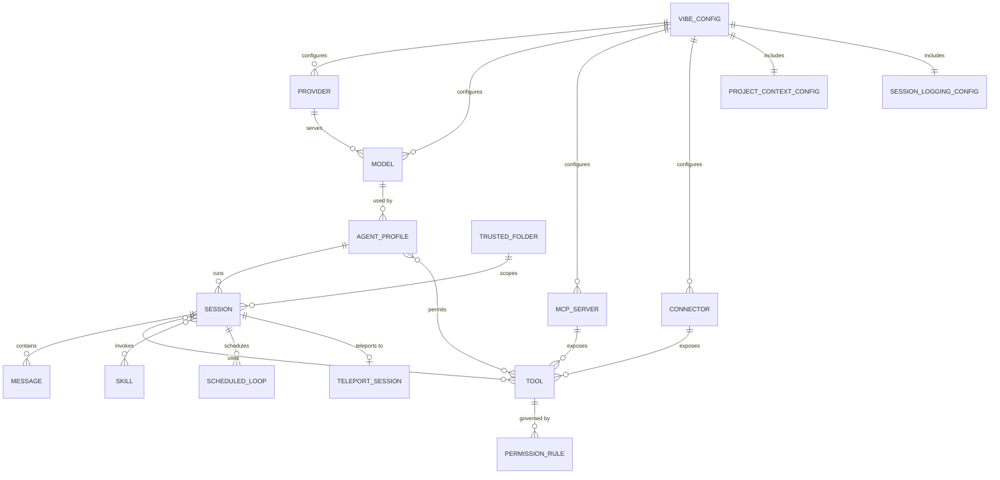

# Entity Model — Mistral Vibe

Mistral Vibe is a command-line coding assistant. It has **no relational database**;
its domain entities are configuration objects (Pydantic models in
`vibe/core/config`), persisted session logs on disk, and runtime structures such
as agent profiles, skills, and tools. The model below describes those conceptual
entities and how they relate. Attribute types are mapped to the AIUP type
vocabulary; "persistence" is a file or the OS keyring rather than a table.

## Entity Relationship Diagram

## Entities

### VIBE_CONFIG

The top-level configuration that controls how Vibe behaves, layered from
built-in defaults, the home configuration, and the project configuration.

| Attribute | Description | Data Type | Length/Precision | Validation Rules |
|-----------|-------------|-----------|------------------|------------------|
| active_model | Identifier of the model used for new turns | String | — | Not Null |
| system_prompt_id | Identifier of the system prompt to apply | String | — | Not Null |
| auto_compact_threshold | Token count that triggers automatic compaction | Integer | — | Not Null, Min: 0 |
| api_timeout | Timeout for model API calls, in seconds | Decimal | — | Not Null, Min: 0 |
| bypass_tool_permissions | Whether tool actions run without prompting | Boolean | — | Not Null |
| enable_telemetry | Whether anonymous telemetry is sent | Boolean | — | Not Null |
| voice_mode_enabled | Whether voice input is active | Boolean | — | Not Null |
| narrator_enabled | Whether replies are read aloud | Boolean | — | Not Null |
| enabled_tools | Explicit allowlist of tool name patterns | String | — | Optional |
| disabled_tools | Denylist of tool name patterns | String | — | Optional |
| default_agent | Name of the agent profile used by default | String | — | Optional |

### PROVIDER

A model provider endpoint that Vibe can call (for example, Mistral's API).

| Attribute | Description | Data Type | Length/Precision | Validation Rules |
|-----------|-------------|-----------|------------------|------------------|
| name | Short identifier of the provider | String | — | Not Null, Unique |
| api_base | Base URL of the provider's API | String | — | Not Null |
| api_key_env_var | Environment variable holding the API key | String | — | Optional |
| api_style | Wire format used by the provider | String | — | Not Null |
| backend | Backend kind for provider-specific behavior | String | — | Not Null, Values: generic, mistral |
| region | Region for region-scoped providers | String | — | Optional |

### MODEL

A specific model offered by a provider, selectable as the active model.

| Attribute | Description | Data Type | Length/Precision | Validation Rules |
|-----------|-------------|-----------|------------------|------------------|
| name | Identifier of the model | String | — | Not Null, Unique |
| provider | Provider that serves the model | String | — | Not Null, Foreign Key (PROVIDER.name) |
| display_name | Human-readable model name | String | — | Optional |

### AGENT_PROFILE

A named behavior profile that defines a system prompt and which tools the
assistant may use; builtins include default, plan, accept-edits, auto-approve,
explore, and lean.

| Attribute | Description | Data Type | Length/Precision | Validation Rules |
|-----------|-------------|-----------|------------------|------------------|
| name | Identifier of the agent profile | String | — | Not Null, Unique |
| display_name | Human-readable profile name | String | — | Not Null |
| description | What the profile is for | String | — | Optional |
| type | Whether the profile is a main agent or subagent | String | — | Not Null, Values: agent, subagent |
| safety | Permission posture of the profile | String | — | Not Null |
| system_prompt_id | System prompt the profile uses | String | — | Optional |

### SESSION

One conversation between a developer and the assistant, persisted to disk and
resumable later.

| Attribute | Description | Data Type | Length/Precision | Validation Rules |
|-----------|-------------|-----------|------------------|------------------|
| session_id | Unique identifier of the session | String | — | Primary Key |
| title | Short human-readable summary of the session | String | — | Optional |
| created_at | When the session was started | DateTime | — | Not Null |
| project_dir | Working directory the session belongs to | String | — | Not Null |
| active_model | Model in use for the session | String | — | Not Null, Foreign Key (MODEL.name) |
| agent_profile | Agent profile in use for the session | String | — | Not Null, Foreign Key (AGENT_PROFILE.name) |

### MESSAGE

A single entry in a session's conversation — a developer prompt, an assistant
reply, a tool call, or a tool result.

| Attribute | Description | Data Type | Length/Precision | Validation Rules |
|-----------|-------------|-----------|------------------|------------------|
| session_id | Session the message belongs to | String | — | Not Null, Foreign Key (SESSION.session_id) |
| role | Who produced the message | String | — | Not Null, Values: user, assistant, tool, system |
| content | Text or structured payload of the message | String | — | Optional |
| created_at | When the message was recorded | DateTime | — | Not Null |
| token_count | Tokens attributed to the message | Integer | — | Optional |

### TOOL

An action the assistant can take — a builtin (read file, edit file, run shell
command, search), or a tool exposed by an MCP server or connector.

| Attribute | Description | Data Type | Length/Precision | Validation Rules |
|-----------|-------------|-----------|------------------|------------------|
| name | Identifier of the tool | String | — | Not Null, Unique |
| description | What the tool does | String | — | Not Null |
| source | Where the tool comes from | String | — | Not Null, Values: builtin, mcp, connector |
| enabled | Whether the tool is currently available | Boolean | — | Not Null |

### PERMISSION_RULE

A rule deciding whether a tool action runs automatically, is denied, or prompts
the developer.

| Attribute | Description | Data Type | Length/Precision | Validation Rules |
|-----------|-------------|-----------|------------------|------------------|
| tool_name | Tool the rule applies to | String | — | Not Null, Foreign Key (TOOL.name) |
| pattern | Command prefix or pattern the rule matches | String | — | Not Null |
| decision | Outcome when the rule matches | String | — | Not Null, Values: allow, deny, ask |

### SKILL

A reusable instruction set the assistant can load to perform a class of task.

| Attribute | Description | Data Type | Length/Precision | Validation Rules |
|-----------|-------------|-----------|------------------|------------------|
| name | Identifier of the skill | String | — | Not Null, Unique, Format: lowercase-hyphenated |
| description | What the skill does and when to use it | String | — | Not Null |
| license | License of the skill | String | — | Optional |
| user_invocable | Whether the skill appears as a slash command | Boolean | — | Not Null |
| allowed_tools | Tools the skill pre-approves | String | — | Optional |

### MCP_SERVER

An external Model Context Protocol server that supplies additional tools.

| Attribute | Description | Data Type | Length/Precision | Validation Rules |
|-----------|-------------|-----------|------------------|------------------|
| name | Short alias used to prefix the server's tool names | String | — | Not Null, Unique |
| prompt | Optional prompt contributed by the server | String | — | Optional |
| disabled | Whether the server is excluded | Boolean | — | Not Null |

### CONNECTOR

Per-connector settings controlling whether a connector and its tools are active.

| Attribute | Description | Data Type | Length/Precision | Validation Rules |
|-----------|-------------|-----------|------------------|------------------|
| name | Identifier of the connector | String | — | Not Null, Unique |
| disabled | Whether the connector is excluded | Boolean | — | Not Null |
| disabled_tools | Tools of the connector that are excluded | String | — | Optional |

### TRUSTED_FOLDER

A working directory with a recorded decision on whether Vibe may load its
project-local configuration.

| Attribute | Description | Data Type | Length/Precision | Validation Rules |
|-----------|-------------|-----------|------------------|------------------|
| path | Absolute path of the directory | String | — | Primary Key |
| trusted | Whether the directory is trusted | Boolean | — | Not Null |

### SCHEDULED_LOOP

A recurring prompt registered to run automatically at a fixed interval.

| Attribute | Description | Data Type | Length/Precision | Validation Rules |
|-----------|-------------|-----------|------------------|------------------|
| loop_id | Identifier of the scheduled loop | String | — | Primary Key |
| interval | Time between runs | String | — | Not Null |
| prompt | Prompt sent on each run | String | — | Not Null |

### TELEPORT_SESSION

A local session that has been handed off to the Vibe Code cloud service.

| Attribute | Description | Data Type | Length/Precision | Validation Rules |
|-----------|-------------|-----------|------------------|------------------|
| session_id | Local session that was teleported | String | — | Not Null, Foreign Key (SESSION.session_id) |
| workflow_id | Cloud workflow the session was uploaded to | String | — | Not Null |
| repository_url | Git repository URL associated with the session | String | — | Not Null |

### PROJECT_CONTEXT_CONFIG

Settings controlling how much project context Vibe gathers before a session.

| Attribute | Description | Data Type | Length/Precision | Validation Rules |
|-----------|-------------|-----------|------------------|------------------|
| default_commit_count | Number of recent commits to include as context | Integer | — | Not Null, Min: 0 |
| timeout_seconds | Time budget for gathering context | Decimal | — | Not Null, Min: 0 |

### SESSION_LOGGING_CONFIG

Settings controlling where and whether sessions are persisted.

| Attribute | Description | Data Type | Length/Precision | Validation Rules |
|-----------|-------------|-----------|------------------|------------------|
| save_dir | Directory where session logs are stored | String | — | Not Null |
| session_prefix | Filename prefix for session logs | String | — | Not Null |
| enabled | Whether sessions are saved at all | Boolean | — | Not Null |
